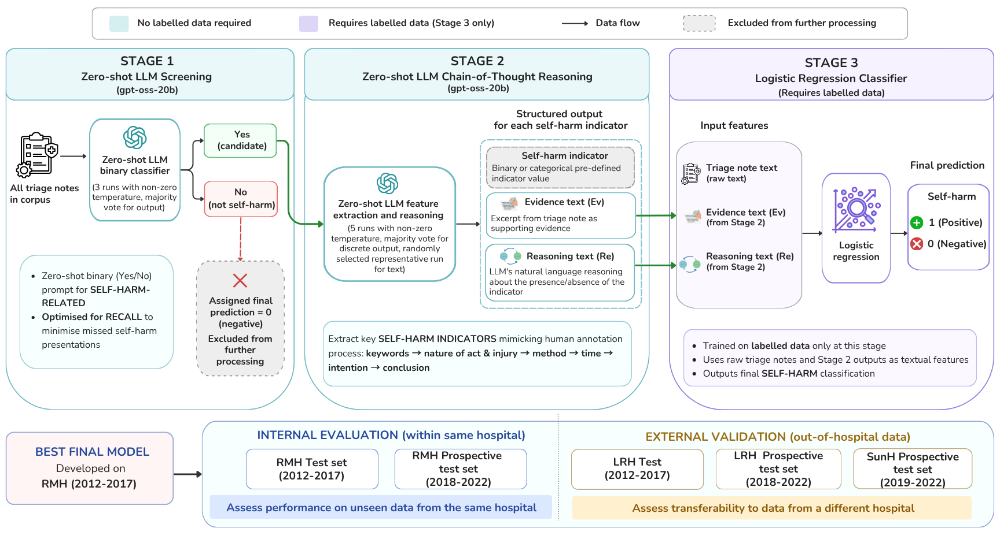

# Transferable Self-Harm Surveillance from Emergency Department Triage Notes Using an Evidence-Augmented Machine Learning Approach

we propose a three-stage approach combining a large language model(LLM) with a traditional machine learning (ML) classifier to detect self-harm in Emergency Department (ED)
triage notes.



The pipeline runs in three stages:

1. **Stage 1 — Zero-shot screening.** An LLM (gpt-oss-20b in our experiments) reads each triage note and decides whether it is **SELF-HARM-RELATED**.
2. **Stage 2 — Zero-shot evidence extraction.** For each note retained by Stage 1, the LLM (gpt-oss-20b in our experiments) produces a structured 7-step rationale (keyword cues, act on body, injury, method, timing, intentionality, final decision).
3. **Stage 3 — Classifier.** A logistic regression model with L2 regularisation combines TF-IDF features over the raw note, MiniLM sentence embeddings, and TF-IDF over the per-step evidence and reasoning text from Stage 2. The decision threshold is tuned on a stratified 20% holdout of the training data.

---

## Repository

```
ED_SH_surveillance/
├── README.md                 
├── LICENSE                   
├── config.py                 single edit point for paths, sites, hyperparameters
├── requirements.txt          
│
└── train_pipeline/
    ├── stage1_screening.py       Stage 1 LLM inference
    ├── stage2_cot_extraction.py  Stage 2 LLM inference
    ├── stage3_classifier.py      Stage 3 training + saving
    ├── rerun_failed.py           rerun Stage 1 records with parsing failures
    ├── feature_extraction.py     shared feature builder for Stage 3
    ├── prompts.py                Stage 1 + Stage 2 prompt builders
    └── utils.py                  response parsing helpers
```

---

## Requirements

Install Python dependencies:

```bash
pip install -r requirements.txt
```

---

## Configuration

Open `config.py` and edit:

1. **`ROOT_DIR`** at the top: set this to the absolute path of your project.
2. **`SITES`** dictionary: add one entry per cohort you want to process. Each entry has:
   - `parquet`: path to the source notes
   - `stage1_jsonl`, `stage2_jsonl`: where outputs will be written
   - `role`: `'train'` if Stage 3 should be trained on this cohort, `'test'` otherwise
3. **`DATA_COL`** dictionary: map the pipeline's three logical fields onto the column
   names in *your* parquet files. Defaults are `uid` / `triage_note` / `SH`:

   ```python
   DATA_COL = {
       'ID':              'uid',           # unique note identifier
       'note':            'triage_note',   # free-text note to classify
       'self_harm_label': 'SH',            # 0/1 gold label
   }
   ```

   These names are also used as the record keys in the jsonl files each stage
   writes, so all three stages stay consistent. This is the only place they are
   defined — no stage script hardcodes a column name.

Example minimal `SITES` for a single-site setup:

```python
SITES = {
    'my_train': {
        'parquet':      DATA_DIR / 'train.parquet',
        'stage1_jsonl': STAGE1_DIR / 'train.jsonl',
        'stage2_jsonl': STAGE2_DIR / 'train.jsonl',
        'role':         'train',
    },
    'my_test': {
        'parquet':      DATA_DIR / 'test.parquet',
        'stage1_jsonl': STAGE1_DIR / 'test.jsonl',
        'stage2_jsonl': STAGE2_DIR / 'test.jsonl',
        'role':         'test',
    },
}
```

Hyperparameters for each stage (token budgets, sampling temperatures, feature dimensions, classifier settings) sit in the `STAGE1`, `STAGE2`, `STAGE3` dicts. Defaults reproduce the paper.

---

## Running the pipeline

### 1. Start the vLLM server

Example launch:

```bash
python -m vllm.entrypoints.openai.api_server \
  --model /path/to/openai_gpt-oss-20b \
  --served-model-name gpt-oss-20b \
  --dtype auto \
  --gpu-memory-utilization 0.85 \
  --max-model-len 8192 \
  --max-num-seqs 64 \
  --enable-prefix-caching \
  --host 127.0.0.1 --port 8000
```

If the server is not on `localhost:8000`, set the `VLLM_API_BASE` constant in `config.py` accordingly.

### 2. Run Stage 1 (LLM screening)

```bash
cd train_pipeline
python stage1_screening.py
```

Add `--sites my_train my_test` to restrict to a subset.

Outputs: one jsonl per site at `config.SITES[<site>]['stage1_jsonl']`. The script supports resume: rerunning continues from the last completed uid.

### 3. (Optional) Rerun parsing failures

A small fraction of notes (roughly under 1%) produce truncated or unparseable JSON in Stage 1, usually because the reasoning model exhausts its token budget. To clean these up:

```bash
python rerun_failed.py
```

The script identifies failed records, reruns them with `MAX_OUTPUT_TOKENS=512` and `reasoning={'effort': 'low'}`, and replaces them in place. Original files are backed up to `<jsonl>.bak_rerun`.

### 4. Run Stage 2 (CoT extraction)

```bash
python stage2_cot_extraction.py
```

For each site, this reads the Stage 1 jsonl, identifies notes whose Stage 1 majority vote is not "no", and runs the structured CoT prompt on those notes only.

Outputs: one jsonl per site at `config.SITES[<site>]['stage2_jsonl']`. Resume mode applies here too.

### 5. Train Stage 3 (classifier)

```bash
python stage3_classifier.py
```

Trains on every site whose `role == 'train'`. Concatenates the configured feature blocks (raw-note TF-IDF, MiniLM embeddings, per-step evidence/reasoning TF-IDF), tunes a decision threshold on a stratified 20% holdout, refits on the full training set, and saves a joblib bundle to `config.STAGE3['save_path']`.

The bundle includes the trained classifier, all TF-IDF vectorisers, the selected threshold, and metadata. Evaluation scripts load this single file.

---

## Outputs

After a successful run:

```
outputs/
├── stage1_screening/<site>.jsonl    one record per note, with self-consistency votes
├── stage2_cot_extraction/<site>.jsonl  one record per Stage-1-kept note
└── stage3_classifier/pipeline.joblib   trained classifier + vectorisers + threshold
```

---

[//]: # (## Resource expectations)

[//]: # ()
[//]: # (On one A100-80GB serving gpt-oss-20b at `--max-num-seqs 64`:)

[//]: # ()
[//]: # (| Stage | Throughput | Time for 100K notes |)

[//]: # (|---|---|---|)

[//]: # (| Stage 1 &#40;3 self-consistency samples&#41; | ~3-4 notes/s | ~8-9 hours |)

[//]: # (| Stage 2 &#40;5 self-consistency samples, only on Stage-1 keeps&#41; | ~0.5 notes/s | depends on Stage-1 retention &#40;~3-4 hours per 5-10K keeps&#41; |)

[//]: # (| Stage 3 &#40;CPU training&#41; | n/a | minutes |)

[//]: # ()
[//]: # (Stage 3 does not require a GPU but the MiniLM embedding step within Stage 3 is GPU-accelerated when a GPU is available.)

[//]: # ()
[//]: # (---)


## Data

The triage notes used in the paper come from de-identified clinical records and **cannot be redistributed**. The pipeline is designed to work with any parquet file that has the four expected columns. 

[//]: # (A small synthetic sample for smoke-testing may be added to the repository in a future commit.)

---

## Citation

If you use this code, please cite:

```
@misc{chen2026transferableselfharmsurveillanceemergency,
      title={Transferable Self-Harm Surveillance from Emergency Department Triage Notes Using an Evidence-Augmented Machine Learning Approach}, 
      author={Liuliu Chen and Gowri Rajaram and Eleanor Bailey and Katrina Witt and Michelle Lamblin and Jo Robinson and Mike Conway and Vlada Rozova},
      year={2026},
      eprint={2606.02545},
      archivePrefix={arXiv},
      primaryClass={cs.CL},
      url={https://arxiv.org/abs/2606.02545}, 
}
```

---

## License

MIT License.
